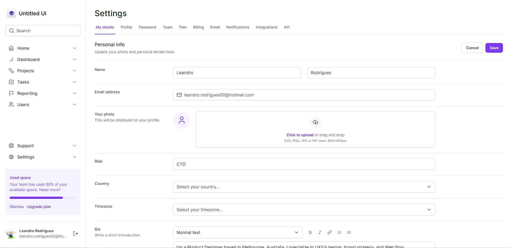

# Tailwind Dashboard - Organize your data 📶

<br>

<p align="center">
  <a href="#-about-the-project">About the project</a> •
  <a href="#-technologies">Technologies</a> •
  <a href="#-getting-started">Getting started</a> •
  <a href="#-license">License</a>
</p>

<p align="center">
 
 
  
</p>

## 👩‍💻 About the project

The Tailwind Dashboard is an innovative website developed to explore and make the most of the exceptional features offered by Tailwind CSS, with the purpose of achieving mastery in this renowned framework.

The project showcases a variety of interesting features, including comprehensive forms with advanced functionalities like file uploads and custom dropdown menus. Furthermore, it has been designed with responsiveness in mind, providing a seamless experience across devices, along with the option for an elegant dark theme.

[click here, see closer](https://tailwind-dashboard-cs.vercel.app/) 😉

## 🔖 Layout

You can view the project layout through the links below:

- [Layout in Figma](<https://www.figma.com/file/6En2t3Zqy1otaq6DfoiGKS/Ignite-Tailwind-(Copy)?type=design&mode=design&t=hP5oxouaPGkxOO6x-0>)

> Remembering that you need to have a [Figma](http://figma.com/) account to access it.

## 🚀 Technologies

- [NextJs 13](https://nextjs.org/)
- [Radix UI](https://www.radix-ui.com/)
- [Tailwind Css](https://tailwindcss.com/)
- [Typescript](https://www.typescriptlang.org/)

## 💻 Getting started

### Requirements

- [Node.js](https://nodejs.org/en/)
- [Yarn](https://classic.yarnpkg.com/) or [NPM](https://www.npmjs.com/) _(examples are with NPM)_

**Clone the project and access the folder**

```bash
$ git clone https://github.com/leandrorodrigues00/tailwind-dashboard && cd tailwind-dashboard

```

**Follow the steps below**

```bash
# Install the dependencies
$ npm i

# Start the app
$ npm run dev
```

## 📝 License

This project is licensed under the MIT License - see the [LICENSE](LICENSE) file for details.

---

<p align="center">
  Made with 💜&nbsp; by  Leandro Rodrigues
</p>
